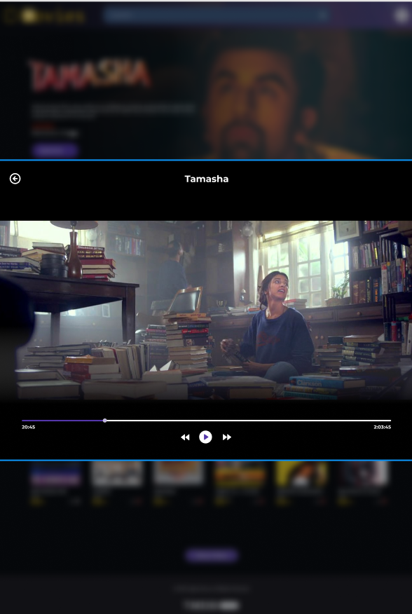

### Front-End - Exercício HTML e CSS

[Proposta atividade - Figma](https://www.figma.com/file/0FOLzrFYdd9GAhKGEHxMQY/frontend-m03-14-desafio?node-id=0%3A1)

- Página principal
  - 
- Modal
  - 
  
###### tags: `css` `formulário` `exercicio` `position` `psedoseletores`  